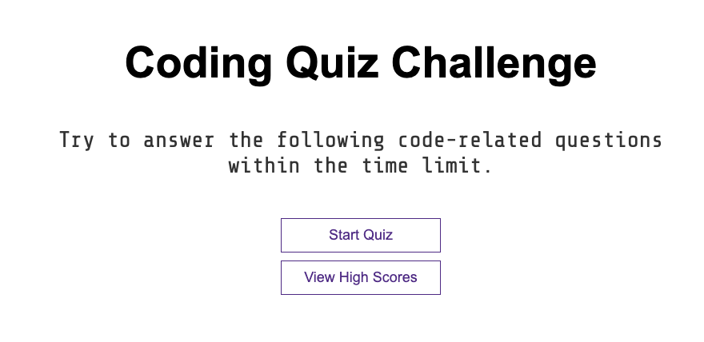

# Quiz-App

## Description

The goal of this application was to allow users to answer a series of coding related questions while keeping track of their correct or incorrect responses. Ultimately, each user has a final score and it is saved in local storage. These scores are then reflected in the leaderboard. 

## Installation

To install this repository just follow your basic ssh clone procedure and use whichever text editor you like. It is completely up to you. This is the live application link

https://rafaelrosas19.github.io/quiz-app/

## Usage

The app will begin once the user clicks the start quiz button. From there they will have an alloted time of 100 seconds to complete the multiple choice quiz. 
If they do not finish the the quiz in the alloted time then they will reach the end screen and will be asked to try again. If the user finishes the quiz they will receive a score out of 40 points and can decide to save their initials to put on the leaderboard. 

## Credits 

I would like to give credit for an online tutorial that I saw by James Q Quick. It was informative and taught me a lot about how to create my app to fit my style and have certain features that I wanted to implement. 

## License

Copyright (c) [2020] [Rafael Rosas]

Permission is hereby granted, free of charge, to any person obtaining a copy of this software and associated documentation files (the "Software"), to deal in the Software without restriction, including without limitation the rights to use, copy, modify, merge, publish, distribute, sublicense, and/or sell copies of the Software, and to permit persons to whom the Software is furnished to do so, subject to the following conditions:

The above copyright notice and this permission notice shall be included in all copies or substantial portions of the Software.

THE SOFTWARE IS PROVIDED "AS IS", WITHOUT WARRANTY OF ANY KIND, EXPRESS OR IMPLIED, INCLUDING BUT NOT LIMITED TO THE WARRANTIES OF MERCHANTABILITY, FITNESS FOR A PARTICULAR PURPOSE AND NONINFRINGEMENT. IN NO EVENT SHALL THE AUTHORS OR COPYRIGHT HOLDERS BE LIABLE FOR ANY CLAIM, DAMAGES OR OTHER LIABILITY, WHETHER IN AN ACTION OF CONTRACT, TORT OR OTHERWISE, ARISING FROM, OUT OF OR IN CONNECTION WITH THE SOFTWARE OR THE USE OR OTHER DEALINGS IN THE SOFTWARE.

